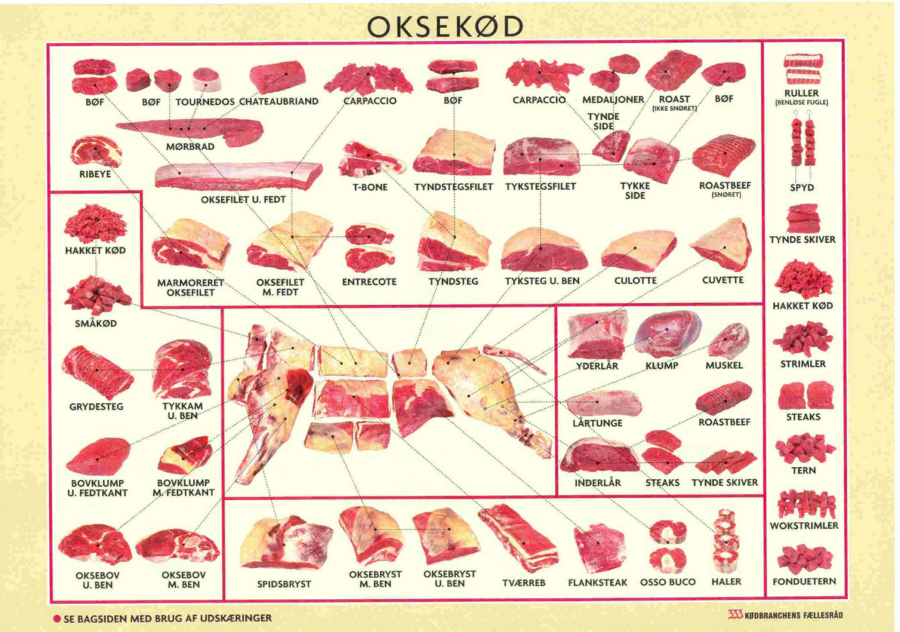
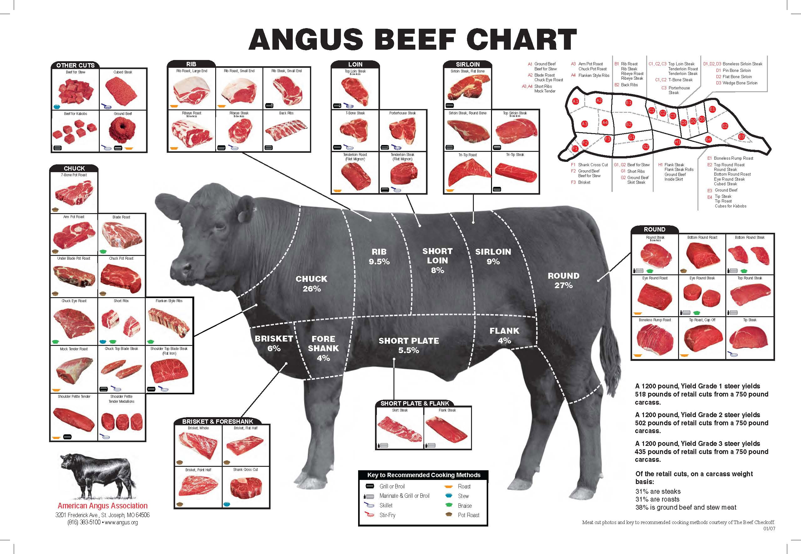
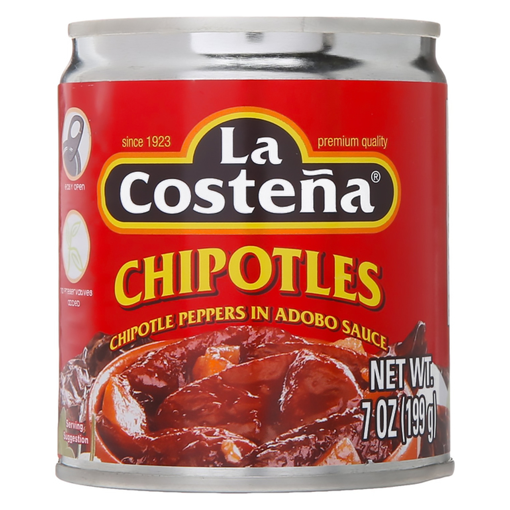

# Beef patties

## Introduktion

Det vigtigste element i en burger er bøffen. Alle kondimenter i verden kan ikke kompensere for en 
dårlig bøf. Det er ofte en "tell" ved ringere burgerrestauranter at de fokuserer
på hvilke kondimenter de kommer i burgeren, gerne med forskellige temaer ("Mexiburger", "BBQ burger", 
"Fransk burger med gedeost", etc.) i stedet for at fokusere på kødets kvalitet og tilberedningsteknik.

Jeg mener at burgeren er det ultimative komfort food og bør derfor være en umami-bombe, 
med et bagtæppe af milde velafbalanceret smage.

Det vigtigste kilde til umami bør komme fra bøffen. Bøffens bidrag til smagsoplevelsen kan deles op i to
komponenter:

- Kødets kvalitet og karakteristika
- Tilberedningsteknik

Kødets kvalitet og udskæringen, samt fedtprocenten har stor indflydelse på hvor meget oksesmagen står frem.
Tilberedningsteknikken bestemmer hvor meget stegeskorpe der kommer på bøffen, som er den måske vigtigste
kilde til umami-smagsoplevelsen i en burger. 

### Kødets kvalitet og karakteristika

Det vigtigst er at burgerbøffen har en god smag af okse. Man skal derfor bruge en muskel
som har arbejdet gennem dyrets levetid. Mørhed er ikke en parameter for hakket kød da det 
klarer kødhakkeren for en. 

"Chuck" er den klassiske Amerikanske udskæring til burgere og hvad der bliver brugt på langt de fleste
lidt bedre burger-joints og steak-house i USA til burger-bøffer. I Danmark er Bovklump eller tykkam 
det tætteste man kommer på den Amerikanske udskæring "chuck", som udgør oksens skulderparti. 
Det er en del af oksen som arbejder hele tiden og rummer derfor en rigtig god smag. 

En mere high-end blanding jeg er stødt på gennem [research](https://www.youtube.com/watch?v=weFT03Mcah0&t=182s) er 

- 50% Sirloin (Tyndstegsfilet)
- 25% Brisket (Spidsbryst)
- 25% Short-rib (Tværreb)

At producere en sådan blend i Danmark er ret dyrt, da man skal hos en slagter
med et særligt udvalg. Resultatet er godt men jeg synes ikke det står målt med prisen.

Man bør ikke vælge det klassiske gaspakket oksekød fra supermarkedet. Fedtprocenten er 
grundlæggende for lav, samt at gassammensætning 
MAPP (Modified Athmosphere Packing) og CA-pakningen (Controlled Athmosphere) gør kødet mere sejt.

Min anbefaling er at bruge bovklump eller tykkam som hovedbestanddelen af hakkekødet og købe et meget fedtholdigt
stykke oksebryst fot at højne fedtprocenten, som skal være på mininum 20%.

I vintersæssonen (fra oktober til april) kan man finde bovklump, tykkam og oksebryst i køledisken
hos supermarkeder med en slagter. Bovklump og tykkam er ofte markeret som "Grydesteg".

I sommersæsonnen må man gå til sin lokale slagter og bestille de udskæringer man skal bruge.
Slagteren kan også hjælpe med at skaffe oksefedt (eller oksetagl som det hedder på fagsprog). 

### Tilberedningsteknik

Næst efter kødets kvalitet kommer hvordan man tilbereder bøffen. Jeg foretrækker [smash-teknikken](https://www.seriouseats.com/ultra-smashed-cheeseburger-recipe-food-lab),
som maksimere mængden af stegeskorpe. Den består i at tage en kugle af hakkekød og 
presse bøffen ud på en meget varm stegeverflade, med en fast metalpalet. På den måde opnår man 
optimal kontakt mellem kødet og stegeoverfladen, som giver en rigtig flot stegeskorpe.

### Udstyr

- [Kødhakker med 6 mm hulskive](https://www.kunstogkokkentoj.dk/product/koedhakker-rf-str-8-hulskive-5mm)
- Kul- eller gasgrill
- Støbejernsplade til grill
- [Vinklet metal palet min. 11 cm i bredden. Ikke bøjelig.](https://www.hwl.dk/paletter/palet-11-cm-icel)

## Ingredienser

| Vægt | Ingrediens |
|-------:|---------:|
| 1000 g  |  Bovklump/Tykkam |
| 500 g  |  Oksebryst  |
|     |  Groft salt |
|     |  Peber |

## Fremgangsmåde

- Puds alt fedt fra Oksebryst.
- Puds alt fedt fra bovklump/tykkammen.
- Vej kød og fedt af så der er 20-25% fedt. Gem det overskydende kød.
- Skær kød og fedt i 2-3 cm tern og spræd ud på en bagplade.
- Sæt kød- og fedttern i fryseren i 30-60 minutter, til de er overfladisk frosne.
- Hak kød- og fedttern på kødhakker 2 gange med 6mm hulskive.
- Form kugler af farsen på 80g-90g. Vælg en størrelse og vær konsistent.
- Sæt farskugler på køl til de skal bruges. 

# Special sauce

Special sauce er den som binder hele burgeren sammen. Den vigtigste ingrediens (udover mayo) er
Adobo-saucen fra en dåse chipotle chilier.

{ height=200px }

## Ingredienser

| Mængde | Ingrediens |
|-------:|---------:|
| 120 ml | mayonnaise 
| 30 ml | ketchup
| 15 ml | fint rævet løg
| 15 ml | saft fra syltede agurker (gerne med dild smag)
| 10 ml | adobo sauce fra dåse chipotle chilier 
| 0.75 g | seleri salt
| 0.75 g | groft salt

## Fremgangsmåde

- Rør alle Ingredienser sammen
