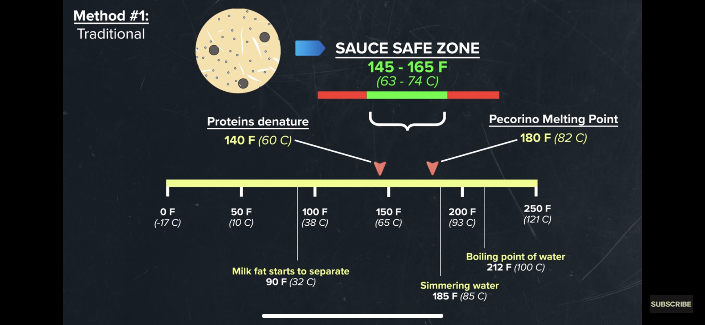

# Background

A Roman pasta dish combining cheese and black pepper. "Cacio e pepe" means "cheese and pepper", the word "Cacio" comes from the latin word "caseus" which is the root of the Spanish "queso" and the German "käse", both meaning _cheese_. 

# Cheese emulsification

Credit to YouTuber [@EthanChlebowski](https://www.youtube.com/watch?v=10lXPzbRoU0).